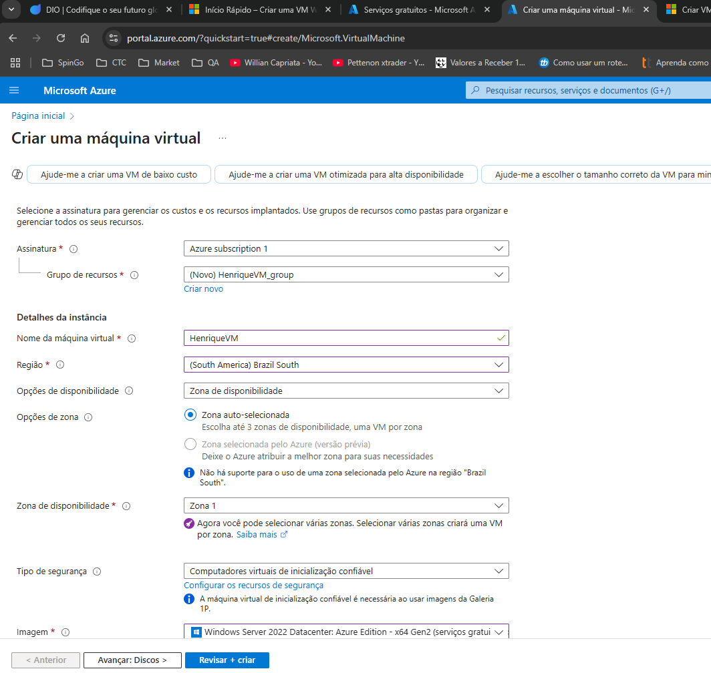
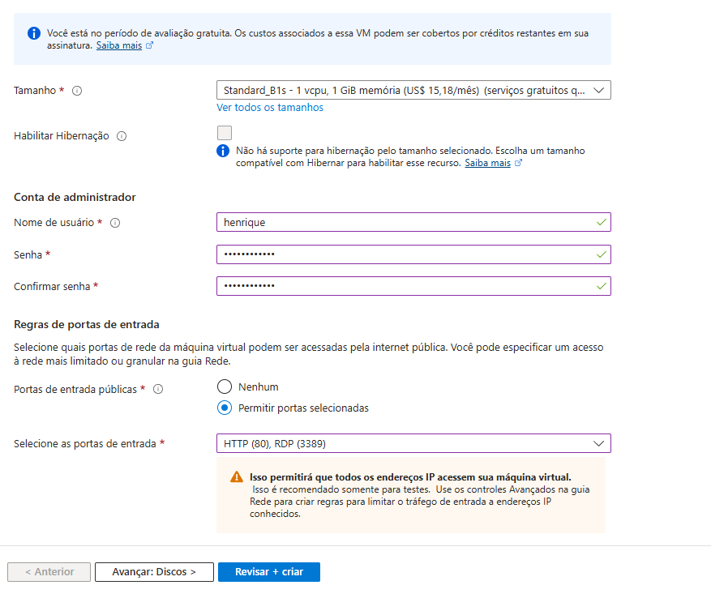
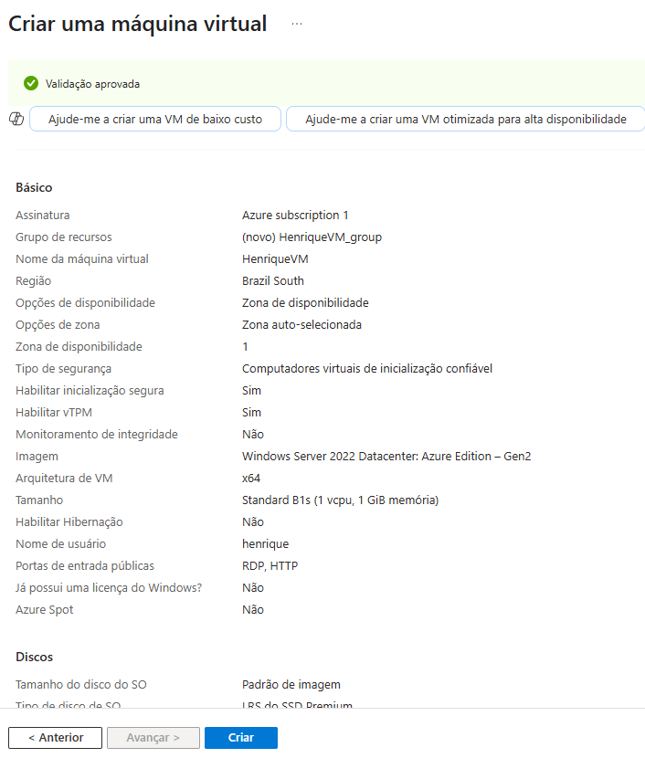
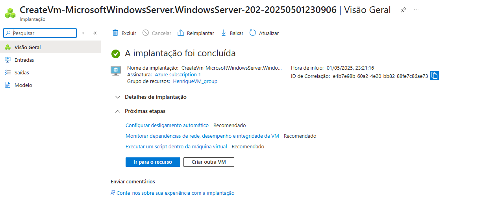
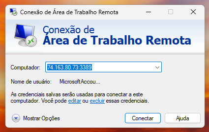
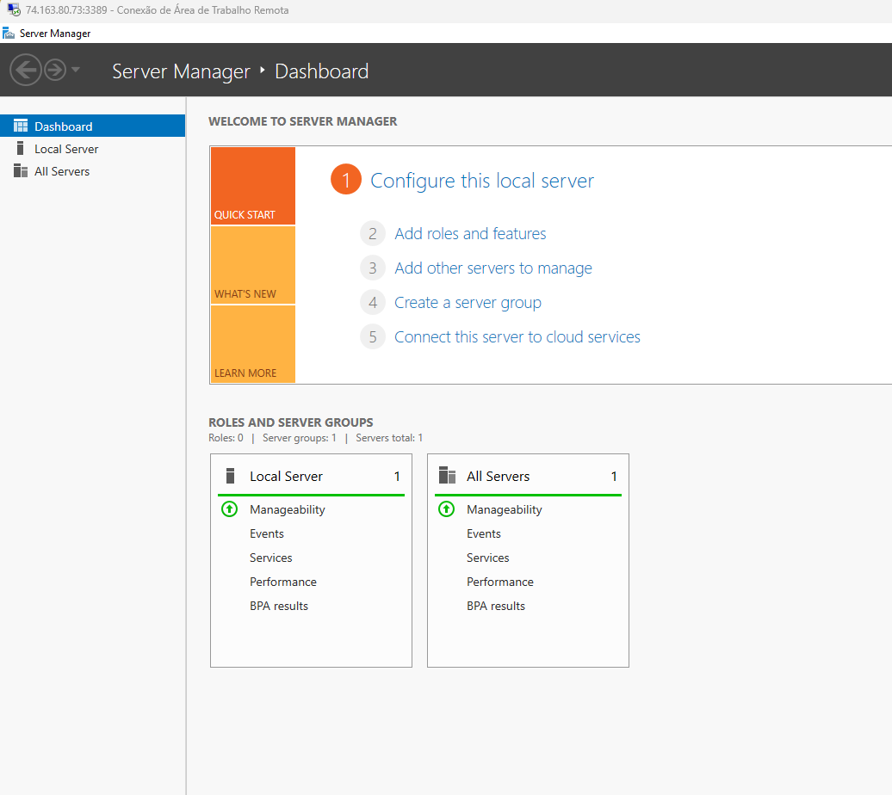

# Criação de máquina Virtual no Azure

Foram seguidos todos os passos e foi criada uma VM. Tirei print das telas, onde mostro a criação e depois a conexão desta VM.

    
    
    
    
    
    

